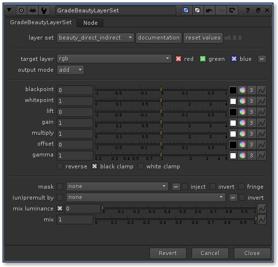
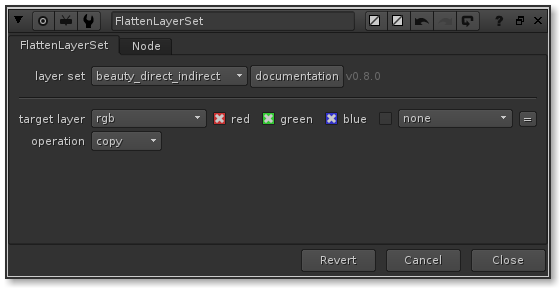
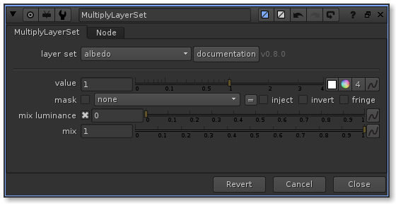

# LayerAlchemy
## C++ Multichannel Nuke plugins


### Nuke installation for compiled builds

```code 
# add this to your init.py and adapt the path to where the package is uncompressed
nuke.pluginAddPath('/path/to/plugin/LayerAlchemy/nuke')
```


### Build instruction example :

```code
git clone https://github.com/sebjacob/LayerAlchemy
```

```code
mkdir /a/new/folder/to/build/in
cd /a/new/folder/to/build/in
cmake /path/to/git/cloned/LayerAlchemyDir -DNUKE_ROOT=/Applications/Nuke11.3v4 -DCMAKE_INSTALL_PREFIX=/Path/to/install/to
```
```code
make # compile the code
make documentation # build the documentation, needs mkdocs (pip install mkdocs)
make install # copies the compiled files to the install directory
make package # creates a compressed file containing the project
```
### Nuke Plugins

##  [GradeBeauty](./documentation/docs/GradeBeauty.md)
GradeBeauty provides artist friendly controls to manipulate multichannel cg render passes
The GradeBeauty design is purposely utilitarian and simple.


##  [GradeBeautyLayerSet](./documentation/docs/GradeBeautyLayerSet.md)
GradeBeautyLayerSet provides a simple way to specifically grade multiple cg layers using a 
[LayerSet](./documentation/docs/core.md#layersets)  

Image processing math is exactly like the Nuke Grade node except that, you can grade multiple layers at the 
same time



##  [GradeBeautyLayer](./documentation/docs/GradeBeautyLayer.md)
GradeBeautyLayer provides a simple way to specifically grade a cg layer and replace it in the beauty


##  [FlattenLayerSet](./documentation/docs/FlattenLayerSet.md)
FlattenLayerSet provides a simple way to merge additive [LayerSet](./documentation/docs/core.md#layersets) 
from multichannel cg render passes to any single layer



##  [RemoveLayerSet](./documentation/docs/RemoveLayerSet.md)
RemoveLayerSet provides a simple way to isolate [LayerSet](./documentation/docs/core.md#layersets)  from multichannel streams


##  [GradeLayerSet](./documentation/docs/GradeLayerSet.md)
GradeLayerSet provides a simple way to grade multiple layers using [LayerSet](./documentation/docs/core.md#layersets) 

_It's exactly like the Nuke Grade node except that, you can grade multiple layers at the same time_

_If you are grading cg layers and wish to propagate the changes to the beauty a the same time, have a look at [FlattenLayerSet](./documentation/docs/FlattenLayerSet.md)_


##  [MultiplyLayerSet](./documentation/docs/MultiplyLayerSet.md)
MultiplyLayerSet provides a simple way to multiply a selection of layers using [LayerSet](./documentation/docs/core.md#layersets) 

_It's exactly like the Nuke Multiply node except that, you can multiply a selection of layers at the same time_


