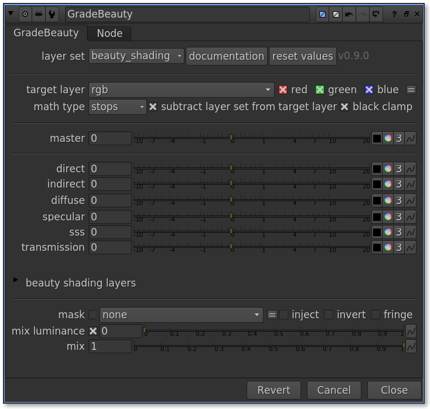
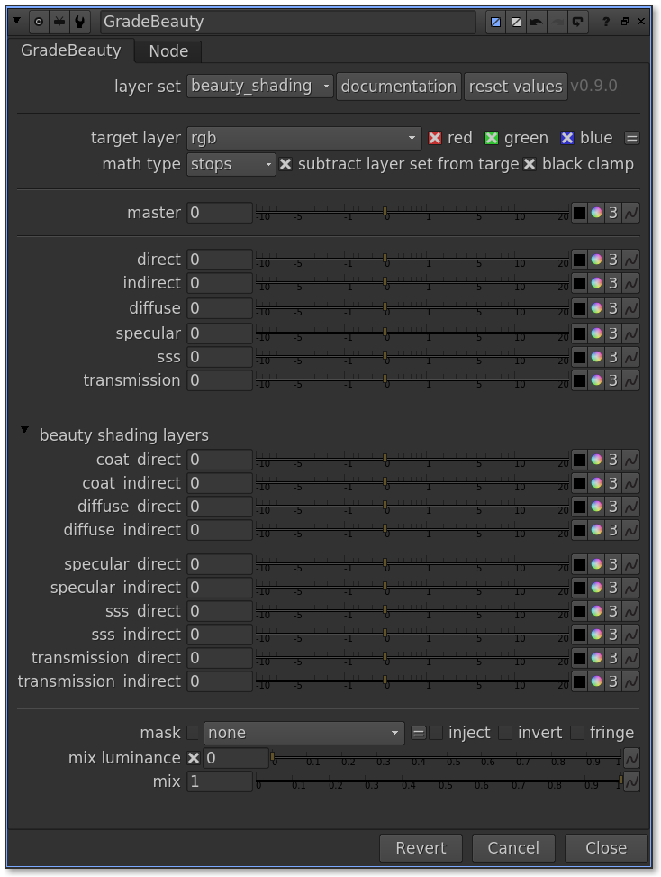

# GradeBeauty 

!!! info "" 

    GradeBeauty provides artist friendly controls to manipulate multichannel cg render passes
    The GradeBeauty design is purposely utilitarian and simple.

## Features
- ***Dynamic reconfiguration***
    * based on layers found connected to its input
    * categorization of found layer names based on what is defined in the configuration files
- ***Color knob change behavior***
    * reflected on the related multichannel layers
    * the beauty pass is simultaneously rebuilt with the modified layers

| "beauty shading" collapsed | "beauty shading" uncollapsed |
| -------------------------- | ---------------------------- |
|||

## Workflow ideas, tips, suggestions

Lighters can use it with the light_group [LayerSet](core.md#layersets) to :

* Tweak light group values and animations, (flicker matching)
* Use two nodes, one in _multiply_ mode, and one in _stops_ mode to adhere to the exposure/gain decoupling
* Send the values back to their cg application !

Compositors:

* Same as above for the lighters, but also share settings easily across multiple shots/artists.
* Cloning the node for global control, if that's possible.
* Use roto/cryptomattes to polish, fix, or address client notes quickly without re-rendering
* If using _beauty_shading_ style, try to use the main controls over individual aovs, unless you have a specific need to (like zeroing it out)

## Knob reference

| knob name | type | what it does |
| --------- | ---- | ------------ |
| layer_set | enumeration | decides which beauty [LayerSet](core.md#layersets) method to use, only found sets will be visible |
| target_layer | enumeration | selects which layer to pre-subtract layers from (if enabled) and add the modified layers to |
| math_type | enumeration | selects the color knob preference
| subtract | bool | controls pre-subtracting the [LayerSet](core.md#layersets) from the target layer |
| solo | bool | toggles the soloing of the last color knob's result
| reset values | button | resets all color knobs to their defaults |

## [PixelIop](https://learn.foundry.com/nuke/developers/11.3/ndkdevguide/2d/pixeliops.html) Knobs
| knob name | type | what it does |
| --------- | ---- | ------------ |
| maskChannelInput | bool/ChannelKnob | selects which masking channel to use |
| unpremult | bool/ChannelKnob | unpremults each relevant layer by this channel |
| mix_luminance | float | mixes in input luminance with the result for all affected layers |
| mix | float | mixes in input with the result |

## Knob value detail
### math_type

| math mode | what it does | value processing explained | notes |
| --------- | ------------ | -------------------------- | ----- |
| multiply | acts like a chain of multiply nodes |master * all global contributions (if any) * layer | _since the layer is multiplied last, you can also use this mode to disable the layer_
| stops | same math as the Nuke exposure node for each layer | it adds all contributions and then does the exposure conversion | _if master is set to 1.0 and the layer is set to 0.0, this means (1.0 + 0 .0) = one stop over_

### subtract
The purpose of the subtract knob is to make sure that the output will always match the beauty render, even if 
some layers are missing, yet included in the beauty render.

This can happen, so it is enabled by default.

| value | what it does | notes |
| ----- | ------------ | ----- |
| enabled | the additive sum of the chosen [LayerSet](core.md#layersets) is subtracted from the target layer before recombining with this node's modifications | 
<i>this means any difference between the target layer and the render layers is kept in the final output</i>

| disabled | bypasses aov/target layer pre-subtraction | _when this is disabled, it replaces the target layer with the result_

### solo

!!! danger "CURRENTLY NOT SAVED, don't rely on it as an output"
    
    Meant as a ***non persistent*** convenience visualizer.
    
    Sometimes, you want to view what's going on under the hood.
    
    This shows you what each slider is doing, as some sliders actually drive multiple layers.
         
    _Depending on feedback, could be made a part of the node processing in a future version._

    | value | what it does | notes |
    | ----- | ------------ | ----- |
    | enabled | outputs the additive sum of the layers being affected by the last color knob that was changed | <i>(this is meant to help visualize layer set  contributions)</i>

    | disabled | bypasses solo processing | |

## Arnold 5 LayerSets

Arnold can separate the beauty render components in various ways.

The following type are natively supported with the [default](https://docs.arnoldrenderer.com/display/A5AFMUG/AOVs#AOVs-AOVs) aov naming :

| layer set name | contents |
| -------------- | --------------- |
| _beauty_direct_indirect_ | direct + indirect illumination layers only |
| _beauty_shading_global_ |  shader components like the result of specular, diffuse, coat |
| _beauty_shading_ | this is a mix of the preceding, except that for each global, there are both direct and indirect aovs. For example, the Color Knob for direct affects all direct aovs |
| _light_group_ | recombine using seperated light contributions only _(control over shading is lost)_ |

If a multichannel input contains any aov belonging to any one of these [LayerSets](core.md#layersets):

* They will become available in the layer_set knob
* GradeBeauty will configure itself to reconstruct the beauty with the chosen [LayerSet](core.md#layersets) 
* _If a multichannel exr has **light_group** and **beauty** aovs, **both** LayerSets will be available_

## Modifying configurations

Your workflow can be different from what is included with this version.

* For cg layer names, the default configuration is Arnold 5 stock layer names only
* The configurations can be adapted to any additive type renderer
* To change this, you must simply modify the configuration files accordingly
* _please read [channels and topology](configs_and_topology.md) if you want to know more, or need to tweak 
them_
