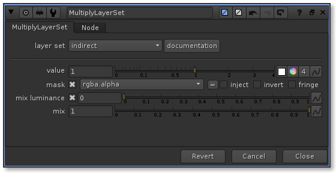

# MultiplyLayerSet 

MultiplyLayerSet provides a simple way to multiply a selection of layers using [LayerSets](core.md#layersets)

It's exactly like the Nuke Multiply node except that, you can multiply a selection of layers at the same time

## Knob reference

| knob name | type | what it does |
| --------- | ---- | ------------
| layer_set | enumeration | decides which [LayerSet](core.md#layersets) to use |

