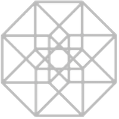

# Welcome to LayerAlchemy
LayerAlchemy is a suite of Nuke plugins for nuke to simplify 2d nodal multichannel workflows

Under the hood, it uses a c++ [yaml](https://yaml.org/) config file based layer name classifier that can be
 adapted to other cg render engines or pipelines.
 
[Getting involved](about.md#Contributing)
